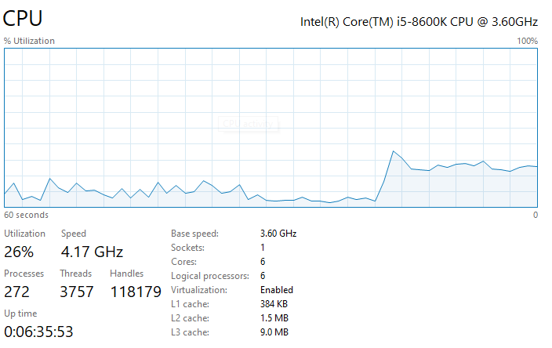
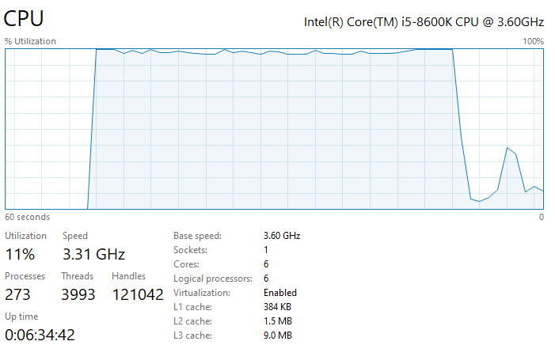

# MPI

mpiexec jaunākajām versijām ir cita sintakse
- Uzstādam https://www.microsoft.com/en-us/download/details.aspx?id=105289
- uz katra no datoriem palaižam smpd -d 0 vai smpd -d 2 ja vēlamies redzēt debug tekstus
- uz galvenā datora palaižam: mpiexec -hosts 1 localhost python f-DistributedMPI.py
- -hosts 1, uz cik datoriem palaidīsim paralēlo procesu
- nākamie aiz -hosts x ir hostname
- sosts failā abos datoros jāieliek abi ip/hostname
- pēc tam palaižamais process, piemēram:
- mpiexec -hosts 2 DESKTOP-60JQQA4 hostB python f-DistributedMPI.py

- Izskatās ka mpiexec strādā izmantojot AD kerberos autentifikāciju, nav iespējams palaist lokālā tīklā
Šo neizdevās novērst.

Kā alternatīvas tika apskatītas citas MPI implementācijas, bet tās nestrādā uz Windows.
Skaidra ir mērogošanas pieeja, bet šim risinājumam ir nepieciešama atbilstoša, sagatavota infrastruktūra.


Piemērs: python f-DistributedMPI
```
python f-DistributedMPI.py
Password found: hellow
Laiks: 89.40 sek, 1 procesi.
```



```
mpiexec -n 6 python f-DistributedMPI.py
Password found: hellow
Laiks: 54.86 sek, 6 procesi.
```



```
mpiexec -hostfile hostfile.txt -n 18 python f-DistributedMPI.py
```
Windows OS, mpiexec nestrādā, ja datori nav vienā domain.
OpenMPI, u.c. implementācijas, pamatā darbojas uz Linux, MacOS sistēmām. Šobrīd nav pieejamas vairākas šādas sistēmas, līdz ar to vairāku datoru testi nevar tikt veikti.